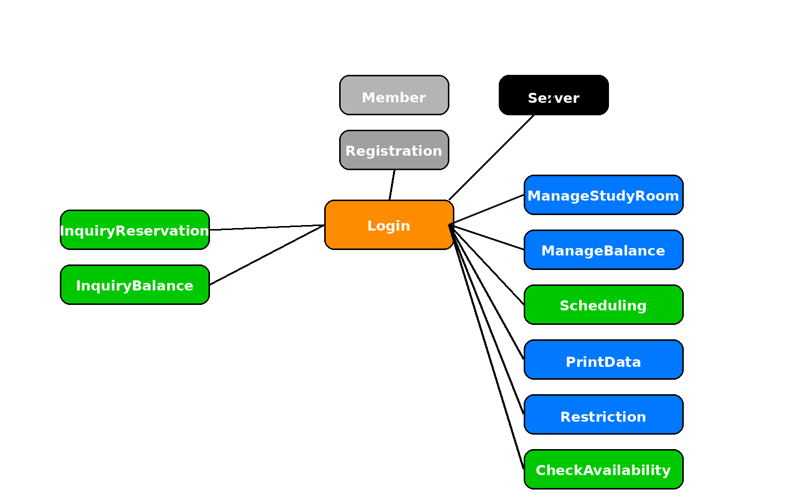
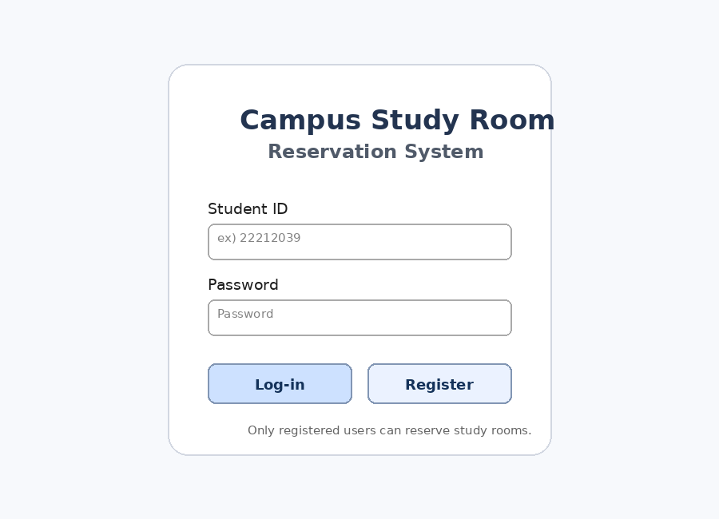
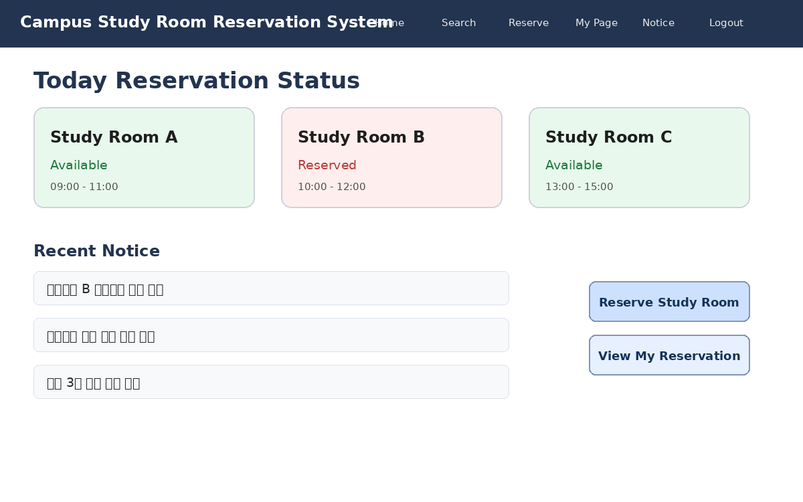
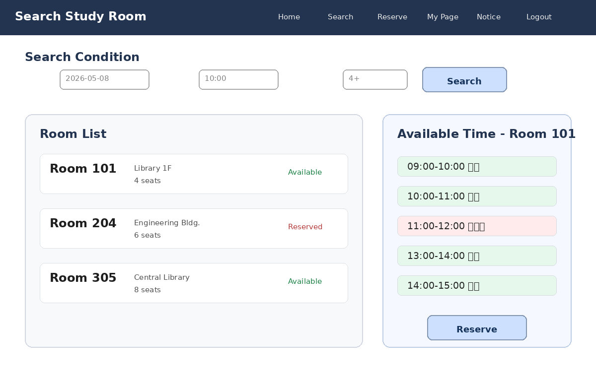
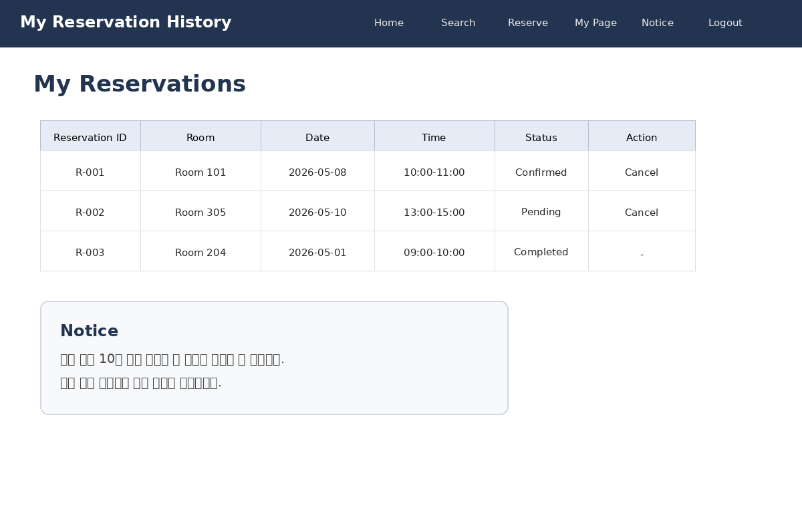

# 2. Analysis

Campus Study Room Reservation System  
캠퍼스 스터디룸 예약 시스템  
(22212039, 강명구, https://github.com/MG-Kang-79)

---

## [ Revision history ]

| Revision date | Version # | Description | Author |
|---|---|---|---|
| MM/DD/YYYY | 0.00 | Type brief description here | Author name |
| 2026/05/07 | 1.00 | 초기버전 | 강명구 |

---

## = Contents =

1. Introduction  
2. Use case analysis  
3. Domain analysis  
4. User Interface prototype  
5. Glossary  
6. References  

---

# Introduction

## 1) Executive Summary

본 문서는 캠퍼스 스터디룸 예약 시스템의 분석 내용을 정리한 문서이다. 이 시스템은 대학 내 스터디룸을 보다 효율적으로 관리하고, 사용자들이 편리하게 예약할 수 있도록 지원하는 것을 목표로 한다.

사용자는 스터디룸의 예약 가능 여부를 확인하고, 원하는 시간대에 예약을 진행하거나 취소할 수 있다. 또한 관리자는 스터디룸 정보 관리, 예약 승인, 공지사항 등록, 사용자 제한 등의 기능을 수행할 수 있다.

본 시스템은 스터디룸 이용의 혼잡 문제를 해결하고 자원의 활용도를 높이는 데 기여할 수 있으며, 향후 다양한 기능으로 확장이 가능한 구조를 가진다.

## 2) Business Goals

본 시스템의 비즈니스 목표는 다음과 같다.

- 스터디룸 예약 과정을 단순화하여 사용자 편의성을 향상시킨다.
- 예약 시스템을 통해 자원의 효율적인 활용을 가능하게 한다.
- 중복 예약 및 노쇼 문제를 줄여 공정한 이용 환경을 제공한다.
- 관리자에게 효율적인 관리 도구를 제공하여 운영 부담을 줄인다.

## 3) Technical Goals

본 시스템은 크게 Server와 Client 구조로 나누어 설계할 수 있다.

Server는 사용자 정보, 스터디룸 정보, 예약 정보 등 시스템에 필요한 모든 데이터를 저장하고 관리하는 역할을 수행한다. 그러나 본 프로젝트에서는 완전한 서버 환경을 구축하지 않고, 데이터베이스를 활용한 간단한 저장 방식으로 이를 대체하여 구현할 예정이다.

이러한 정보들은 중요한 데이터이므로 아무나 수정할 수 없도록 해야 한다. 따라서 관리자 권한을 가진 사용자만이 스터디룸 정보 수정, 사용자 제한, 공지사항 등록 등의 기능을 수행할 수 있도록 설계한다.

Client는 일반 사용자와 관리자로 구분되며, 사용자는 회원가입을 통해 계정을 생성하고 로그인을 완료해야만 시스템의 기능을 정상적으로 이용할 수 있도록 한다. 로그인 과정을 통해 사용자 인증을 수행함으로써 시스템의 보안을 유지한다.

또한 사용자가 시스템을 이용하는 과정에서 각 기능이 빠르게 수행될 수 있도록 효율적인 처리 방식을 적용한다. 예를 들어, 예약 가능 여부 확인이나 예약 처리와 같은 기능은 짧은 시간 내에 결과를 제공할 수 있도록 설계한다.

마지막으로, 사용자 인터페이스는 직관적이고 이해하기 쉬운 형태로 구성하여 누구나 쉽게 사용할 수 있도록 한다. 이를 위해 간단하고 명확한 GUI 구조를 적용한다.

---

# 2. Use case analysis

## 2.1 Use Case Diagram

Conceptualization Document에서 정의 했던 Use Case List를 바탕으로 위와 같은 Diagram을 도출하였다. Use Case는 동사로 시작하도록 Naming을 하였다. Actor는 Member와 Administrator로 총 두 개로 나타내었다. 그리고 각 기능별로 연관성에 따라 include 관계나 exclude관계가 적용이 되었다.

아래는 각 Use Case의 ID와 Korean Name, Actor를 나타낸 표이다.

| Use Case Name | Use case ID | Korean Name | Actor |
|---|---|---|---|
| Register Member | #1 | 회원가입 | User |
| Login | #2 | 로그인 | User, Administrator |
| Search Study Room | #3 | 스터리룸 조회 | User |
| Check Availability | #4 | 예약 가능 시간 확인 | User |
| Reserve Study Room | #5 | 스터디룸 예약 | User |
| Cancel Reservation | #6 | 예약 취소 | User |
| View Reservation History | #7 | 예약 내역 조회 | User |
| Manage Study Room | #8 | 스터디룸 관리 | Administrator |
| Approve or Reject Reservation | #9 | 예약 승인/거절 | Administrator |
| Manage Notice | #10 | 공지사항 관리 | Administrator |
| Restrict User | #11 | 사용자 이용 제한 | Administrator |

Use Case Description에서는 위에서부터 차례대로 각 Use Case에 대해 표로 Description을 보여줄 것이다.

---

## 2.2 Use case Description

## 2.2.1. Register Member

### Use Case #1 : Register Member

#### GENERAL CHARACTERISTICS

| 항목 | 내용 |
|---|---|
| Summary | 사용자가 시스템을 처음 이용하기 위해 회원가입을 수행한다. |
| Scope | Campus Study Room Reservation System |
| Level | User level |
| Author | 강명구 |
| Last Update | 07/05/2026 |
| Status | Analysis |
| Primary Actor | User |
| Secondary Actors | Database Server |
| Preconditions | 시스템이 실행되어야 한다. |
| Trigger | 사용자가 메인 화면에서 회원가입 버튼을 선택한다. |
| Success Post Condition | 사용자 계정 정보가 시스템에 등록된다. |
| Failed Post Condition | 입력 정보가 올바르지 않거나 중복된 정보가 있을 경우 회원가입에 실패한다. |

#### MAIN SUCCESS SCENARIO

| Step | Action |
|---|---|
| S | 사용자가 시스템 이용을 위해 회원가입을 시도한다. |
| 1 | 사용자는 시스템을 실행한다. |
| 2 | 사용자는 메인 화면에서 회원가입 버튼을 선택한다. |
| 3 | 시스템은 회원가입에 필요한 정보 입력 화면을 보여준다. |
| 4 | 사용자는 학번, 이름, 이메일, 비밀번호를 입력한다. |
| 5 | 시스템은 입력된 정보의 형식과 중복 여부를 검사한다. |
| 6 | 입력 정보가 올바르면 사용자 정보를 Database Server에 저장한다. |
| 7 | 회원가입 성공 메시지를 출력하고 종료한다. |

#### EXTENSION SCENARIOS

| Step | Action |
|---|---|
| 4 | 4a. 사용자가 필수 정보를 입력하지 않은 경우 |
|  | 4a.1. 시스템은 필수 정보를 입력하라는 메시지를 출력한다. |
|  | 4a.2. 회원가입 화면으로 돌아간다. |
| 5 | 5a. 이미 등록된 학번 또는 이메일인 경우 |
|  | 5a.1. 시스템은 이미 등록된 정보라는 메시지를 출력한다. |
|  | 5a.2. 회원가입 화면으로 돌아간다. |

#### RELATED INFORMATION

| 항목 | 내용 |
|---|---|
| Performance | ≦ 3 Seconds |
| Frequency | Variable |
| Concurrency | None |
| Due Date | 07/05/2026 |
| Etc | None |

---

## 2.2.2. Login

### Use Case #2 : Login

#### GENERAL CHARACTERISTICS

| 항목 | 내용 |
|---|---|
| Summary | 등록된 사용자와 관리자가 시스템에 로그인하여 권한에 맞는 기능을 사용할 수 있다. |
| Scope | Campus Study Room Reservation System |
| Level | User level |
| Author | 강명구 |
| Last Update | 07/05/2026 |
| Status | Analysis |
| Primary Actor | User, Administrator |
| Secondary Actors | Database Server |
| Preconditions | 사용자가 회원가입을 마친 상태여야 한다. |
| Trigger | 사용자가 ID와 Password를 입력하고 로그인 버튼을 누른다. |
| Success Post Condition | 저장된 사용자 정보와 일치하면 시스템에 로그인된다. |
| Failed Post Condition | 저장된 사용자 정보와 일치하지 않으면 로그인에 실패한다. |

#### MAIN SUCCESS SCENARIO

| Step | Action |
|---|---|
| S | 사용자가 시스템에 로그인하려고 시도한다. |
| 1 | 사용자는 로그인 화면을 연다. |
| 2 | 사용자는 ID와 Password를 입력한다. |
| 3 | 사용자는 로그인 버튼을 누른다. |
| 4 | 시스템은 Database Server에서 사용자 정보를 조회한다. |
| 5 | 입력 정보가 저장된 정보와 일치하면 로그인을 허용한다. |
| 6 | 시스템은 사용자의 권한에 맞는 메인 화면을 출력한다. |

#### EXTENSION SCENARIOS

| Step | Branching Action |
|---|---|
| 2 | 2a. ID 또는 Password를 입력하지 않은 경우 |
|  | 2a.1. 시스템은 입력값이 필요하다는 메시지를 출력한다. |
|  | 2a.2. 로그인 화면으로 돌아간다. |
| 4 | 4a. ID 또는 Password가 일치하지 않는 경우 |
|  | 4a.1. 시스템은 로그인 실패 메시지를 출력한다. |
|  | 4a.2. 로그인 화면으로 돌아간다. |

#### RELATED INFORMATION

| 항목 | 내용 |
|---|---|
| Performance | ≦ 3 Seconds |
| Frequency | Variable |
| Concurrency | None |
| Due Date | 07/05/2026 |
| Etc | None |

---

## 2.2.3. Search Study Room

### Use Case #3 : Search Study Room

#### GENERAL CHARACTERISTICS

| 항목 | 내용 |
|---|---|
| Summary | 사용자가 스터디룸 목록과 기본 정보를 조회한다. |
| Scope | Campus Study Room Reservation System |
| Level | User level |
| Author | 강명구 |
| Last Update | 07/05/2026 |
| Status | Analysis |
| Primary Actor | User |
| Secondary Actors | Database Server |
| Preconditions | 사용자가 로그인한 상태여야 한다. |
| Trigger | 사용자가 스터디룸 조회 메뉴를 선택한다. |
| Success Post Condition | 스터디룸 목록과 상세 정보가 화면에 출력된다. |
| Failed Post Condition | 스터디룸 정보를 불러오지 못한다. |

#### MAIN SUCCESS SCENARIO

| Step | Action |
|---|---|
| S | 사용자가 이용 가능한 스터디룸 정보를 조회한다. |
| 1 | 사용자는 메인 화면에서 스터디룸 조회 메뉴를 선택한다. |
| 2 | 시스템은 Database Server에서 스터디룸 정보를 불러온다. |
| 3 | 시스템은 스터디룸 이름, 위치, 수용 인원, 운영 시간 등을 화면에 출력한다. |
| 4 | 사용자는 원하는 스터디룸을 선택할 수 있다. |

#### EXTENSION SCENARIOS

| Step | Branching Action |
|---|---|
| 2 | 2a. 스터디룸 정보를 불러오지 못한 경우 |
|  | 2a.1. 시스템은 데이터 조회 실패 메시지를 출력한다. |
|  | 2a.2. 메인 화면으로 돌아간다. |

#### RELATED INFORMATION

| 항목 | 내용 |
|---|---|
| Performance | ≦ 3 Seconds |
| Frequency | Variable |
| Concurrency | None |
| Due Date | 2026.07.05 |
| Etc | None |

---

## 2.2.4. Check Availability

### Use Case #4 : Check Availability

#### GENERAL CHARACTERISTICS

| 항목 | 내용 |
|---|---|
| Summary | 사용자가 특정 날짜와 시간대에 스터디룸 예약 가능 여부를 확인한다. |
| Scope | Campus Study Room Reservation System |
| Level | User level |
| Author | 강명구 |
| Last Update | 07/05/2026 |
| Status | Analysis |
| Primary Actor | User |
| Secondary Actors | Database Server |
| Preconditions | 사용자가 로그인한 상태여야 한다. |
| Trigger | 사용자가 스터디룸과 날짜를 선택하고 예약 가능 시간 조회 버튼을 누른다. |
| Success Post Condition | 선택한 날짜의 예약 가능 시간대가 화면에 출력된다. |
| Failed Post Condition | 예약 정보를 불러오지 못하거나 선택한 날짜의 시간대 정보를 표시하지 못한다. |

#### MAIN SUCCESS SCENARIO

| Step | Action |
|---|---|
| S | 사용자가 특정 스터디룸의 예약 가능 여부를 확인하려고 한다. |
| 1 | 사용자는 스터디룸 목록에서 원하는 스터디룸을 선택한다. |
| 2 | 사용자는 예약하고자 하는 날짜를 선택한다. |
| 3 | 사용자는 예약 가능 시간 조회 버튼을 누른다. |
| 4 | 시스템은 Database Server에서 해당 스터디룸의 예약 정보를 조회한다. |
| 5 | 시스템은 이미 예약된 시간과 예약 가능한 시간을 구분한다. |
| 6 | 시스템은 예약 가능한 시간대를 사용자에게 출력한다. |

#### EXTENSION SCENARIOS

| Step | Branching Action |
|---|---|
| 2 | 2a. 사용자가 날짜를 선택하지 않은 경우 |
|  | 2a.1. 시스템은 날짜를 선택하라는 메시지를 출력한다. |
|  | 2a.2. 날짜 선택 화면으로 돌아간다. |
| 4 | 4a. 예약 정보를 불러오지 못한 경우 |
|  | 4a.1. 시스템은 데이터 조회 실패 메시지를 출력한다. |
|  | 4a.2. 스터디룸 조회 화면으로 돌아간다. |

#### RELATED INFORMATION

| 항목 | 내용 |
|---|---|
| Performance | ≦ 3 Seconds |
| Frequency | Variable |
| Concurrency | Multiple users may check availability at the same time |
| Due Date | 2026.07.05 |
| Etc | None |

---

## 2.2.5. Reserve Study Room

### Use Case #5 : Reserve Study Room

#### GENERAL CHARACTERISTICS

| 항목 | 내용 |
|---|---|
| Summary | 사용자가 원하는 스터디룸과 시간대를 선택하여 예약한다. |
| Scope | Campus Study Room Reservation System |
| Level | User level |
| Author | 강명구 |
| Last Update | 07/05/2026 |
| Status | Analysis |
| Primary Actor | User |
| Secondary Actors | Database Server |
| Preconditions | 사용자가 로그인한 상태이고, 선택한 시간대가 예약 가능 상태여야 한다. |
| Trigger | 사용자가 예약 가능한 시간대를 선택하고 예약 버튼을 누른다. |
| Success Post Condition | 예약 정보가 Database Server에 저장되고 예약 완료 메시지가 출력된다. |
| Failed Post Condition | 이미 예약된 시간대이거나 데이터 저장에 실패하면 예약이 완료되지 않는다. |

#### MAIN SUCCESS SCENARIO

| Step | Action |
|---|---|
| S | 사용자가 스터디룸을 예약하려고 한다. |
| 1 | 사용자는 스터디룸 목록에서 원하는 스터디룸을 선택한다. |
| 2 | 사용자는 날짜와 시간대를 선택한다. |
| 3 | 시스템은 해당 시간대의 예약 가능 여부를 다시 확인한다. |
| 4 | 사용자는 예약 버튼을 누른다. |
| 5 | 시스템은 예약 정보를 Database Server에 저장한다. |
| 6 | 시스템은 예약 완료 메시지를 출력한다. |
| 7 | 예약 정보가 사용자의 예약 내역에 반영된다. |

#### EXTENSION SCENARIOS

| Step | Branching Action |
|---|---|
| 3 | 3a. 선택한 시간대가 이미 예약된 경우 |
|  | 3a.1. 시스템은 이미 예약된 시간이라는 메시지를 출력한다. |
|  | 3a.2. 시간 선택 화면으로 돌아간다. |
| 5 | 5a. 예약 정보 저장에 실패한 경우 |
|  | 5a.1. 시스템은 예약 실패 메시지를 출력한다. |
|  | 5a.2. 예약 화면으로 돌아간다. |

#### RELATED INFORMATION

| 항목 | 내용 |
|---|---|
| Performance | ≦ 3 Seconds |
| Frequency | Variable |
| Concurrency | Multiple users may attempt reservation |
| Due Date | 2026.07.05 |
| Etc | 중복 예약 방지 필요 |

---

## 2.2.6. Cancel Reservation

### Use Case #6 : Cancel Reservation

#### GENERAL CHARACTERISTICS

| 항목 | 내용 |
|---|---|
| Summary | 사용자가 기존에 등록한 예약을 취소한다. |
| Scope | Campus Study Room Reservation System |
| Level | User level |
| Author | 강명구 |
| Last Update | 07/05/2026 |
| Status | Analysis |
| Primary Actor | User |
| Secondary Actors | Database Server |
| Preconditions | 사용자가 로그인한 상태이고, 취소할 예약 내역이 존재해야 한다. |
| Trigger | 사용자가 예약 내역에서 취소할 예약을 선택하고 취소 버튼을 누른다. |
| Success Post Condition | 예약 상태가 취소로 변경되고 해당 시간대가 다시 예약 가능 상태가 된다. |
| Failed Post Condition | 예약 내역이 없거나 취소 처리에 실패하면 예약이 취소되지 않는다. |

#### MAIN SUCCESS SCENARIO

| Step | Action |
|---|---|
| S | 사용자가 예약을 취소하려고 한다. |
| 1 | 사용자는 예약 내역 화면으로 이동한다. |
| 2 | 시스템은 사용자의 예약 목록을 Database Server에서 불러온다. |
| 3 | 사용자는 취소할 예약을 선택한다. |
| 4 | 사용자는 예약 취소 버튼을 누른다. |
| 5 | 시스템은 해당 예약 상태를 취소로 변경한다. |
| 6 | 시스템은 취소된 시간대를 다시 예약 가능 상태로 반영한다. |
| 7 | 시스템은 예약 취소 완료 메시지를 출력한다. |

#### EXTENSION SCENARIOS

| Step | Branching Action |
|---|---|
| 2 | 2a. 사용자의 예약 내역이 없는 경우 |
|  | 2a.1. 시스템은 예약 내역이 없다는 메시지를 출력한다. |
|  | 2a.2. 메인 화면으로 돌아간다. |
| 5 | 5a. 예약 취소 처리에 실패한 경우 |
|  | 5a.1. 시스템은 취소 실패 메시지를 출력한다. |
|  | 5a.2. 예약 내역 화면으로 돌아간다. |

#### RELATED INFORMATION

| 항목 | 내용 |
|---|---|
| Performance | ≦ 3 Seconds |
| Frequency | Variable |
| Concurrency | None |
| Due Date | 2026.07.05 |
| Etc | 예약 취소 후 시간대 상태 변경 필요 |

---

## 2.2.7. View Reservation History

### Use Case #7 : View Reservation History

#### GENERAL CHARACTERISTICS

| 항목 | 내용 |
|---|---|
| Summary | 사용자가 자신의 예약 및 취소 내역을 조회한다. |
| Scope | Campus Study Room Reservation System |
| Level | User level |
| Author | 강명구 |
| Last Update | 07/05/2026 |
| Status | Analysis |
| Primary Actor | User |
| Secondary Actors | Database Server |
| Preconditions | 사용자가 로그인한 상태여야 한다. |
| Trigger | 사용자가 예약 내역 조회 메뉴를 선택한다. |
| Success Post Condition | 사용자의 예약 내역이 화면에 출력된다. |
| Failed Post Condition | 예약 내역 정보를 불러오지 못한다. |

#### MAIN SUCCESS SCENARIO

| Step | Action |
|---|---|
| S | 사용자가 예약 내역을 확인하려고 한다. |
| 1 | 사용자는 메인 화면에서 예약 내역 조회 메뉴를 선택한다. |
| 2 | 시스템은 현재 로그인한 사용자의 정보를 확인한다. |
| 3 | 시스템은 Database Server에서 해당 사용자의 예약 내역을 조회한다. |
| 4 | 시스템은 예약 날짜, 스터디룸 이름, 예약 시간, 예약 상태를 화면에 출력한다. |
| 5 | 사용자는 자신의 예약 내역을 확인한다. |

#### EXTENSION SCENARIOS

| Step | Branching Action |
|---|---|
| 3 | 3a. 예약 내역이 존재하지 않는 경우 |
|  | 3a.1. 시스템은 예약 내역이 없다는 메시지를 출력한다. |
|  | 3a.2. 메인 화면으로 돌아간다. |
| 3 | 3b. 예약 데이터를 불러오지 못한 경우 |
|  | 3b.1. 시스템은 데이터 조회 실패 메시지를 출력한다. |
|  | 3b.2. 메인 화면으로 돌아간다. |

#### RELATED INFORMATION

| 항목 | 내용 |
|---|---|
| Performance | ≦ 3 Seconds |
| Frequency | Variable |
| Concurrency | None |
| Due Date | 2026.07.05 |
| Etc | None |

---

## 2.2.8. Manage Study Room

### Use Case #8 : Manage Study Room

#### GENERAL CHARACTERISTICS

| 항목 | 내용 |
|---|---|
| Summary | 관리자가 스터디룸 정보를 등록, 수정, 삭제한다. |
| Scope | Campus Study Room Reservation System |
| Level | User level |
| Author | 강명구 |
| Last Update | 07/05/2026 |
| Status | Analysis |
| Primary Actor | Administrator |
| Secondary Actors | Database Server |
| Preconditions | 관리자가 관리자 권한으로 로그인한 상태여야 한다. |
| Trigger | 관리자가 스터디룸 관리 메뉴를 선택한다. |
| Success Post Condition | 스터디룸 정보가 등록, 수정 또는 삭제된다. |
| Failed Post Condition | 관리자 권한이 없거나 데이터 저장에 실패하면 정보가 변경되지 않는다. |

#### MAIN SUCCESS SCENARIO

| Step | Action |
|---|---|
| S | 관리자가 스터디룸 정보를 관리하려고 한다. |
| 1 | 관리자는 관리자 계정으로 로그인한다. |
| 2 | 관리자는 스터디룸 관리 메뉴를 선택한다. |
| 3 | 시스템은 기존 스터디룸 목록을 출력한다. |
| 4 | 관리자는 정보를 추가/수정/삭제한다. |
| 5 | 시스템은 변경된 정보를 Database Server에 저장한다. |
| 6 | 시스템은 스터디룸 정보 변경 완료 메시지를 출력한다. |

#### EXTENSION SCENARIOS

| Step | Branching Action |
|---|---|
| 1 | 1a. 관리자 권한이 아닌 사용자가 접근한 경우 |
|  | 1a.1. 시스템은 접근 권한이 없다는 메시지를 출력한다. |
|  | 1a.2. 메인 화면으로 돌아간다. |
| 5 | 5a. 스터디룸 정보 저장에 실패한 경우 |
|  | 5a.1. 시스템은 저장 실패 메시지를 출력한다. |
|  | 5a.2. 스터디룸 관리 화면으로 돌아간다. |

#### RELATED INFORMATION

| 항목 | 내용 |
|---|---|
| Performance | ≦ 3 Seconds |
| Frequency | Variable |
| Concurrency | None |
| Due Date | 2026.07.05 |
| Etc | Administrator only |

---

## 2.2.9. Approve or Reject Reservation

### Use Case #9 : Approve or Reject Reservation

#### GENERAL CHARACTERISTICS

| 항목 | 내용 |
|---|---|
| Summary | 관리자가 예약 요청을 확인하고 승인 또는 거절한다. |
| Scope | Campus Study Room Reservation System |
| Level | User level |
| Author | 강명구 |
| Last Update | 07/05/2026 |
| Status | Analysis |
| Primary Actor | Administrator |
| Secondary Actors | Database Server |
| Preconditions | 관리자가 관리자 권한으로 로그인한 상태이고, 예약 요청이 존재해야 한다. |
| Trigger | 관리자가 예약 요청 목록에서 승인 또는 거절 버튼을 누른다. |
| Success Post Condition | 예약 상태가 승인 또는 거절 상태로 변경된다. |
| Failed Post Condition | 예약 요청 정보를 불러오지 못하거나 상태 변경에 실패한다. |

#### MAIN SUCCESS SCENARIO

| Step | Action |
|---|---|
| S | 관리자가 예약 요청을 처리하려고 한다. |
| 1 | 관리자는 관리자 계정으로 로그인한다. |
| 2 | 관리자는 예약 요청 관리 메뉴를 선택한다. |
| 3 | 시스템은 승인 대기 중인 예약 요청 목록을 보여준다. |
| 4 | 관리자는 예약 요청의 사용자, 스터디룸, 날짜, 시간 정보를 확인한다. |
| 5 | 관리자는 예약을 승인하거나 거절한다. |
| 6 | 시스템은 예약 상태를 Database Server에 저장한다. |
| 7 | 시스템은 처리 결과를 사용자에게 표시한다. |

#### EXTENSION SCENARIOS

| Step | Branching Action |
|---|---|
| 3 | 3a. 승인 대기 중인 예약 요청이 없는 경우 |
|  | 3a.1. 시스템은 처리할 예약 요청이 없다는 메시지를 출력한다. |
|  | 3a.2. 관리자 메인 화면으로 돌아간다. |
| 6 | 6a. 예약 상태 변경에 실패한 경우 |
|  | 6a.1. 시스템은 처리 실패 메시지를 출력한다. |
|  | 6a.2. 예약 요청 관리 화면으로 돌아간다. |

#### RELATED INFORMATION

| 항목 | 내용 |
|---|---|
| Performance | ≦ 3 Seconds |
| Frequency | Variable |
| Concurrency | None |
| Due Date | 2026.07.05 |
| Etc | 승인과 거절은 하나의 유스케이스 내 분기 처리로 구성한다. |

---

## 2.2.10. Manage Notice

### Use Case #10 : Manage Notice

#### GENERAL CHARACTERISTICS

| 항목 | 내용 |
|---|---|
| Summary | 관리자가 스터디룸 이용과 관련된 공지사항을 등록, 수정, 삭제한다. |
| Scope | Campus Study Room Reservation System |
| Level | User level |
| Author | 강명구 |
| Last Update | 07/05/2026 |
| Status | Analysis |
| Primary Actor | Administrator |
| Secondary Actors | Database Server |
| Preconditions | 관리자가 관리자 권한으로 로그인한 상태여야 한다. |
| Trigger | 관리자가 공지사항 관리 메뉴를 선택한다. |
| Success Post Condition | 공지사항이 등록, 수정 또는 삭제되어 사용자 화면에 반영된다. |
| Failed Post Condition | 공지사항 저장 또는 수정에 실패한다. |

#### MAIN SUCCESS SCENARIO

| Step | Action |
|---|---|
| S | 관리자가 사용자에게 공지사항을 전달하려고 한다. |
| 1 | 관리자는 관리자 계정으로 로그인한다. |
| 2 | 관리자는 공지사항 관리 메뉴를 선택한다. |
| 3 | 시스템은 기존 공지사항 목록을 출력한다. |
| 4 | 관리자는 공지사항을 등록, 수정 또는 삭제한다. |
| 5 | 시스템은 변경된 공지사항 정보를 Database Server에 저장한다. |
| 6 | 시스템은 공지사항 변경 완료 메시지를 출력한다. |
| 7 | 변경된 공지사항은 사용자 화면에 표시된다. |

#### EXTENSION SCENARIOS

| Step | Branching Action |
|---|---|
| 1 | 1a. 관리자 권한이 아닌 사용자가 접근한 경우 |
|  | 1a.1. 시스템은 접근 권한이 없다는 메시지를 출력한다. |
|  | 1a.2. 메인 화면으로 돌아간다. |
| 5 | 5a. 공지사항 저장에 실패한 경우 |
|  | 5a.1. 시스템은 저장 실패 메시지를 출력한다. |
|  | 5a.2. 공지사항 관리 화면으로 돌아간다. |

#### RELATED INFORMATION

| 항목 | 내용 |
|---|---|
| Performance | ≦ 3 Seconds |
| Frequency | Variable |
| Concurrency | None |
| Due Date | 2026.07.05 |
| Etc | Administrator only |

---

## 2.2.11. Restrict User

### Use Case #11 : Restrict User

#### GENERAL CHARACTERISTICS

| 항목 | 내용 |
|---|---|
| Summary | 관리자가 규정을 위반한 사용자에게 예약 제한을 설정한다. |
| Scope | Campus Study Room Reservation System |
| Level | User level |
| Author | 강명구 |
| Last Update | 07/05/2026 |
| Status | Analysis |
| Primary Actor | Administrator |
| Secondary Actors | Database Server |
| Preconditions | 관리자가 관리자 권한으로 로그인한 상태이고, 제한할 사용자가 존재해야 한다. |
| Trigger | 관리자가 사용자 관리 화면에서 특정 사용자를 선택하고 제한 설정 버튼을 누른다. |
| Success Post Condition | 해당 사용자의 예약 기능이 일정 기간 제한된다. |
| Failed Post Condition | 사용자 정보를 불러오지 못하거나 제한 설정에 실패한다. |

#### MAIN SUCCESS SCENARIO

| Step | Action |
|---|---|
| S | 관리자가 사용자를 제한하려고 한다. |
| 1 | 관리자는 사용자 목록을 조회한다. |
| 2 | 제한할 사용자를 선택한다. |
| 3 | 제한 기간과 사유를 입력한다. |
| 4 | 시스템은 제한 정보를 저장한다. |
| 5 | 해당 사용자의 예약 기능을 차단한다. |

#### EXTENSION SCENARIOS

| Step | Branching Action |
|---|---|
| 3 | 3a. 사용자 정보를 불러오지 못한 경우 |
|  | 3a.1. 시스템은 사용자 정보 조회 실패 메시지를 출력한다. |
|  | 3a.2. 관리자 메인 화면으로 돌아간다. |
| 5 | 5a. 제한 기간 또는 사유를 입력하지 않은 경우 |
|  | 5a.1. 시스템은 제한 정보를 입력하라는 메시지를 출력한다. |
|  | 5a.2. 제한 설정 화면으로 돌아간다. |
| 6 | 6a. 제한 정보 저장에 실패한 경우 |
|  | 6a.1. 시스템은 제한 설정 실패 메시지를 출력한다. |
|  | 6a.2. 사용자 관리 화면으로 돌아간다. |

#### RELATED INFORMATION

| 항목 | 내용 |
|---|---|
| Performance | ≦ 3 Seconds |
| Frequency | Variable |
| Concurrency | None |
| Due Date | 2026.07.05 |
| Etc | 노쇼 또는 반복 위반 사용자에게 적용한다. |

---

# 3. Domain analysis

아래의 그림은 Domain Analysis에서 나오는 Class들의 관계를 간단하게 나타낸 그림이다.

1. Member : Member Actor와 Administrator Actor가 공통으로 갖는 Attribute와 Operation을 정의하는 클래스이다. (예를 들어 ID, Password, 이름, 이메일 등) 또한 회원가입 시 입력되는 사용자 정보를 저장하고 관리하는 역할을 수행한다.

2. StudyRoom : 캠퍼스 내 스터디룸의 정보를 저장하는 클래스이다. (예를 들어 스터디룸 ID, 위치, 수용 인원, 사용 가능 여부 등) 사용자는 이 정보를 기반으로 스터디룸을 조회하고 선택할 수 있다.

3. Server : 시스템 내에서 데이터를 저장하고 관리하는 역할을 수행하는 클래스이다. 실제 서버를 구축하지 않기 때문에 이를 대신하는 역할을 한다. 회원 정보, 스터디룸 정보, 예약 정보 등 여러 데이터를 저장하고 각 기능 클래스에 데이터를 제공한다.

4. Reservation : 사용자가 스터디룸을 예약한 정보를 저장하는 클래스이다. (예를 들어 사용자 ID, 스터디룸 ID, 예약 날짜, 시간, 상태 등) 예약 생성, 취소, 조회 기능에서 핵심적으로 사용된다.

5. ManageStudyRoom : Administrator가 스터디룸 정보를 관리하는 기능을 담당하는 클래스이다. Server 클래스로부터 데이터를 가져와 스터디룸을 추가, 수정, 삭제하는 역할을 수행한다.

6. InquiryReservation : Member Actor가 자신의 예약 내역을 확인하는 기능을 가진 클래스이다. Server에서 예약 데이터를 가져와 사용자에게 보여주는 역할을 한다.

7. CheckAvailability : 사용자가 특정 날짜와 시간에 예약 가능한 스터디룸을 확인하는 기능을 가진 클래스이다. Server에서 예약 정보를 가져와 가능한 시간대를 계산하여 제공한다.

8. Registration : 시스템을 사용하기 위해 회원가입을 수행하는 클래스이다. 사용자가 입력한 정보를 검증한 후 Server에 저장하는 역할을 한다.

9. PrintData : Server에 저장된 예약 데이터나 사용자 데이터를 출력하는 기능을 가진 클래스이다. 예를 들어 예약 내역을 파일 형태로 출력할 수 있다.

10. Session : 사용자의 로그인 상태를 유지하고 인증 정보를 관리하는 클래스이다. 로그인 성공 시 세션을 생성하고, 로그아웃 시 세션을 종료한다.

11. Restriction : 규정을 위반한 사용자에게 예약 제한을 적용하는 기능을 가진 클래스이다. 관리자가 설정한 제한 기간 동안 해당 사용자의 예약 기능을 차단한다.

---

# 4. User Interface prototype

## 4.1.1. Log-in

사용자가 프로그램을 실행하면 위와 같은 로그인 화면을 볼 수 있다. 사용자는 ID 입력란에 자신의 학번을 입력하고 Password 입력란에 설정한 비밀번호를 입력하여 로그인할 수 있다. 회원가입을 하지 않은 경우 “Register” 버튼을 눌러 회원가입 화면으로 이동할 수 있다. 입력한 정보가 서버에 저장된 정보와 일치하면 로그인에 성공하고 시스템 내부로 접근할 수 있다.

## 4.1.2. Registration

위 화면은 “Register” 버튼을 눌렀을 때 나타나는 회원가입 화면이다. 사용자는 ID, Password, Name, Department, E-Mail 등의 정보를 입력해야 한다.

ID는 중복될 수 없으며 “중복 확인” 기능을 통해 기존 사용자 여부를 확인할 수 있다. 모든 정보를 입력한 후 “확인” 버튼을 누르면 회원가입이 완료되며, 이후 로그인하여 시스템을 사용할 수 있다.

## 4.1.3. Main Screen

로그인에 성공하면 위와 같은 메인 화면이 나타난다. 사용자는 이 화면에서 스터디룸 조회, 예약, 예약 내역 확인 등의 기능을 사용할 수 있다. 상단 메뉴를 통해 각 기능으로 이동할 수 있으며, 시스템의 주요 정보가 중앙 화면에 표시된다. “HOME” 버튼을 누르면 언제든지 메인 화면으로 돌아올 수 있다.

## 4.1.4. Study Room Inquiry

사용자가 스터디룸 조회 기능을 선택하면 위와 같은 화면이 나타난다. 이 화면에서는 현재 이용 가능한 스터디룸 목록을 확인할 수 있으며, 각 스터디룸의 위치와 수용 인원 등의 정보도 함께 제공된다. 사용자는 원하는 스터디룸을 선택하여 예약을 진행할 수 있다.

## 4.1.5. Reservation Screen

사용자가 스터디룸을 선택하면 예약 화면으로 이동한다. 사용자는 날짜와 시간대를 선택하여 예약을 진행할 수 있다. 이미 예약된 시간은 선택할 수 없으며, 예약 가능한 시간만 표시된다. 예약 버튼을 누르면 해당 정보가 서버에 저장되고 예약이 완료된다.

## 4.1.6. Reservation History

사용자는 자신의 예약 내역을 확인할 수 있다. 이 화면에서는 예약한 스터디룸, 날짜, 시간 등의 정보가 표시된다. 또한 사용자는 필요에 따라 예약을 취소할 수 있으며, 취소된 예약은 다시 예약 가능한 상태로 변경된다.

---

# 5. Glossary

용어사전에 대해선 다음과 같다

| Terms | Description |
|---|---|
| User | 시스템을 이용하여 스터디룸을 조회하고 예약하는 학생 사용자를 의미한다. |
| Administrator | 스터디룸 정보 관리, 예약 승인 및 거절, 공지사항 관리, 사용자 제한 기능을 수행하는 관리자이다. |
| Study Room | 사용자가 예약하여 이용할 수 있는 캠퍼스 내 스터디 공간을 의미한다. |
| Reservation | 사용자가 특정 날짜와 시간대에 스터디룸을 이용하기 위해 등록한 예약 정보이다. |
| Time Slot | 스터디룸 예약이 가능한 일정 단위의 시간 구간을 의미한다. 예를 들어 09:00~10:00, 10:00~11:00과 같은 시간 단위이다. |
| Reservation Status | 예약의 현재 상태를 의미한다. 예약 완료, 승인 대기, 승인, 거절, 취소 등의 상태를 포함한다. |
| Reservation Conflict | 동일한 날짜와 시간대에 같은 스터디룸을 여러 사용자가 중복으로 예약하려는 상황을 의미한다 |
| Notice | 관리자가 사용자에게 전달하는 공지사항을 의미한다. 스터디룸 이용 규칙, 점검 일정, 예약 제한 안내 등을 포함할 수 있다. |
| Restriction | 노쇼나 규정 위반 사용자에게 일정 기간 예약 기능을 제한하는 기능을 의미한다. |
| GUI | 사용자가 버튼, 입력창, 표와 같은 화면 요소를 통해 시스템을 쉽게 사용할 수 있도록 만든 그래픽 사용자 인터페이스를 의미한다. |
| Database | 사용자 정보, 스터디룸 정보, 예약 정보, 공지사항 정보를 저장하고 관리하는 데이터 저장소를 의미한다. |
| Session | 사용자가 로그인한 후 시스템을 이용하는 동안 유지되는 접속 상태를 의미한다. |

---

# 6. References

- 강의자료 (소프트웨어 설계 강의자료)
