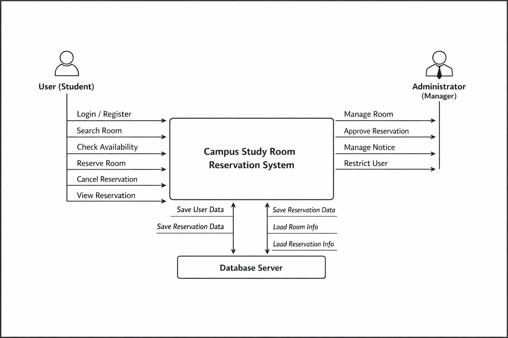

# 1. Conceptualization
Campus Study Room Reservation System  
캠퍼스 스터디룸 예약 시스템  
(22212039, 강명구, https://github.com/MG-Kang-79)

---

## [ Revision history ]

| Revision date | Version # | Description | Author |
|--------------|----------|-------------|--------|
| 24/03/2026 | 1.00 | First draft | 강명구 |

---

## = Contents =

1. Business purpose  
2. System context diagram  
3. Use case list  
4. Concept of operation  
5. Problem statement  
6. Glossary  
7. References  

---

## 1. Business purpose

대학교 내에는 스터디룸과 같은 공용 학습 공간이 존재하며, 이는 학생들의 팀 프로젝트, 시험 준비, 동아리 활동 등에 중요한 역할을 한다. 그러나 현재 많은 학교에서는 스터디룸 예약이 비효율적으로 관리되거나, 예약 현황을 실시간으로 확인하기 어려운 문제가 존재한다. 이로 인해 중복 예약, 노쇼(no-show), 비어 있는 공간의 비효율적 사용과 같은 문제가 자주 발생한다. 기존의 예약 방식은 공지 게시판이나 수기 관리, 또는 제한된 시스템을 통해 이루어지는 경우가 많아 사용자 입장에서 원하는 시간에 이용 가능한 공간을 찾는 데 불편함이 있다. 또한 예약 변경이나 취소가 즉시 반영되지 않아 다른 사용자가 해당 공간을 활용하지 못하는 상황이 발생하기도 한다. 관리자 역시 예약 현황을 수동으로 관리해야 하기 때문에 운영 효율이 떨어진다. 이러한 문제를 해결하기 위해 본 프로젝트에서는 캠퍼스 스터디룸 예약 시스템을 개발하고자 한다. 본 시스템은 사용자가 스터디룸의 예약 가능 여부를 확인하고, 원하는 시간대에 예약 및 취소를 수행할 수 있도록 지원한다. 또한 관리자는 스터디룸 정보 관리, 예약 승인 및 제한, 공지 등록 등의 기능을 통해 시설을 효율적으로 운영할 수 있다. 본 시스템의 주요 목표는 다음과 같다. 첫째, 사용자의 편의성 향상으로, 실시간 예약 정보를 제공하여 빠르고 간편한 예약을 가능하게 한다. 둘째, 시설 운영의 효율성 증대로, 예약 데이터를 체계적으로 관리하여 공간 활용도를 높인다. 셋째, 공정한 이용 환경 제공으로, 예약 정책과 이용 기록을 기반으로 모든 사용자가 공평하게 시설을 이용할 수 있도록 한다. 본 시스템의 주요 대상은 대학 내 스터디룸을 이용하는 학생과 시설 관리자이다.

---

## 2. System context diagram

---

## 3. Use case list

1) Register Member  
Actor User  
Description 사용자는 시스템 이용을 위해 회원가입을 수행한다.  

2) Login  
Actor User, Administrator  
Description 등록된 사용자는 로그인하여 시스템 기능을 이용한다.  

3) Search Study Room  
Actor User  
Description 사용자는 스터디룸 목록 및 정보를 조회한다.  

4) Check Availability  
Actor User  
Description 사용자는 특정 날짜와 시간대의 예약 가능 여부를 확인한다.  

5) Reserve Study Room  
Actor User  
Description 사용자는 원하는 시간대의 스터디룸을 예약한다.  

6) Cancel Reservation  
Actor User  
Description 사용자는 기존 예약을 취소한다.  

7) View Reservation History  
Actor User  
Description 사용자는 자신의 예약 내역을 조회한다.  

8) Manage Study Room  
Actor Administrator  
Description 관리자는 스터디룸 정보(이름, 수용 인원 등)를 등록 및 수정한다.  

9) Approve or Reject Reservation  
Actor Administrator  
Description 관리자는 예약 요청을 승인하거나 거절한다.  

10) Manage Notice  
Actor Administrator  
Description 관리자는 공지사항을 등록, 수정, 삭제한다.  

11) Restrict User  
Actor Administrator  
Description 관리자는 규정을 위반한 사용자에게 예약 제한을 설정한다.  

---

## 4. Concept of operation

1) Register Member  
Purpose 사용자가 시스템의 기능을 이용하기 위해 회원가입을 할 수 있도록 한다.  
Approach 사용자는 회원가입 화면에서 학번, 이름, 이메일, 비밀번호와 같은 기본 정보를 입력한다. 시스템은 입력된 정보의 형식을 검사하고, 중복된 학번 또는 이메일이 없는지 확인한 뒤 회원 정보를 데이터베이스에 저장한다. 회원가입이 완료되면 사용자는 로그인 기능을 이용할 수 있다.  
Dynamics 사용자가 처음으로 시스템을 이용하고자 할 경우  
Goals 회원 정보를 등록하여 사용자가 시스템의 예약 기능을 사용할 수 있도록 한다.  

2) Login  
Purpose 등록된 사용자가 자신의 계정으로 시스템에 접근할 수 있도록 한다.  
Approach 사용자는 로그인 화면에서 아이디와 비밀번호를 입력한다. 시스템은 데이터베이스에 저장된 회원 정보와 비교하여 일치 여부를 확인한다. 입력 정보가 올바른 경우 로그인에 성공하고, 그렇지 않으면 오류 메시지를 출력한다. 로그인 성공 시 사용자는 자신의 권한에 맞는 기능을 사용할 수 있다.  
Dynamics 사용자가 시스템의 기능을 사용하고자 할 경우  
Goals 인증된 사용자만 시스템에 접근하게 하여 안전하게 기능을 사용할 수 있도록 한다.  

3) Search Study Room  
Purpose 사용자가 스터디룸 목록과 기본 정보를 확인할 수 있도록 한다.  
Approach 사용자는 시스템에 로그인한 후 스터디룸 목록 화면으로 이동한다. 시스템은 데이터베이스에서 스터디룸 이름, 위치, 수용 인원, 사용 가능 시간 등의 정보를 불러와 목록 형태로 보여준다. 사용자는 이를 통해 원하는 스터디룸을 선택할 수 있다.  
Dynamics 사용자가 이용 가능한 스터디룸 정보를 알고 싶을 경우  
Goals 사용자가 각 스터디룸의 기본 정보를 쉽게 파악하고 적절한 공간을 선택할 수 있도록 한다.  

4) Check Availability  
Purpose 사용자가 특정 날짜와 시간대에 스터디룸 예약이 가능한지 확인할 수 있도록 한다.  
Approach 사용자는 원하는 스터디룸과 날짜를 선택한다. 시스템은 데이터베이스에 저장된 예약 정보를 조회하여 해당 날짜의 시간대별 예약 현황을 표시한다. 이미 예약된 시간은 사용할 수 없도록 표시하고, 비어 있는 시간대만 예약 가능 상태로 보여준다.  
Dynamics 사용자가 특정 시간대의 예약 가능 여부를 확인하고자 할 경우  
Goals 예약 가능한 시간대를 정확하게 제공하여 중복예약과 불필요한 시도를 줄인다.  

5) Reserve Study Room  
Purpose 사용자가 원하는 스터디룸을 원하는 시간대에 예약할 수 있도록 한다.  
Approach 사용자는 예약 가능한 시간대를 확인한 후 원하는 시간대를 선택하여 예약 요청을 보낸다. 시스템은 해당 시간대가 여전히 예약 가능한 상태인지 다시 확인한 뒤 예약 정보를 저장한다. 예약이 정상적으로 완료되면 시스템은 예약 완료 메시지를 사용자에게 보여주고 예약 내역에 반영한다.  
Dynamics 사용자가 스터디룸을 실제로 이용하기 위해 예약하고자 할 경우  
Goals 사용자가 쉽고 빠르게 스터디룸을 예약할 수 있도록 하며, 예약 정보를 정확하게 관리한다.  

6) Cancel Reservation  
Purpose 사용자가 더 이상 필요하지 않은 예약을 취소할 수 있도록 한다.  
Approach 사용자는 자신의 예약 내역 화면에서 취소할 예약을 선택한다. 시스템은 해당 예약이 취소 가능한 상태인지 확인한 뒤 예약 상태를 취소로 변경한다. 취소가 완료되면 해당 시간대는 다시 예약 가능한 상태로 갱신되고, 사용자에게 취소 완료 메시지가 제공된다.  
Dynamics 사용자가 예약을 변경하거나 스터디룸을 이용하지 못하게 된 경우  
Goals 예약 취소를 즉시 반영하여 다른 사용자가 해당 시간대를 다시 이용할 수 있도록 한다.  

7) View Reservation History  
Purpose 사용자가 자신의 예약 및 취소 내역을 확인할 수 있도록 한다.  
Approach 사용자가 예약 내역 조회 기능을 선택하면 시스템은 데이터베이스에서 해당 사용자의 예약 기록을 검색한다. 시스템은 예약 날짜, 스터디룸 이름, 예약 시간, 예약 상태 등의 정보를 목록 형태로 제공한다. 사용자는 이를 통해 자신의 현재 예약과 과거 이용 기록을 확인할 수 있다.  
Dynamics 사용자가 자신이 예약한 내역을 확인하고 싶을 경우  
Goals 사용자가 예약 상태를 쉽게 확인하고, 필요한 경우 취소 또는 변경 판단을 할 수 있도록 한다.  

8) Manage Study Room  
Purpose 관리자가 스터디룸 정보를 등록하고 수정할 수 있도록 한다.  
Approach 관리자는 관리자 계정으로 로그인한 뒤 스터디룸 관리 화면에 접근한다. 관리자는 스터디룸 이름, 위치, 수용 인원, 운영 시간, 사용 가능 여부 등의 정보를 입력하거나 수정할 수 있다. 시스템은 변경된 정보를 데이터베이스에 저장하고 이후 사용자 조회 화면에 반영한다.  
Dynamics 관리자가 새로운 스터디룸을 추가하거나 기존 정보를 수정할 경우  
Goals 스터디룸 정보를 최신 상태로 유지하여 사용자에게 정확한 정보를 제공한다.  

9) Approve or Reject Reservation  
Purpose 관리자가 예약 요청을 검토하고 승인 또는 거절할 수 있도록 한다.  
Approach 승인이 필요한 예약의 경우, 시스템은 예약 요청을 대기 상태로 저장한다. 관리자는 예약 요청 목록에서 사용자 정보, 예약 시간, 스터디룸 정보를 확인한 후 승인 또는 거절을 선택한다. 시스템은 그 결과를 데이터베이스에 저장하고 사용자에게 승인 여부를 알려준다.  
Dynamics 특정 스터디룸 또는 특정 시간대에 대해 관리자 승인이 필요할 경우  
Goals 관리자가 예약을 통제하여 시설 운영의 공정성과 질서를 유지할 수 있도록 한다.  

10) Manage Notice  
Purpose 관리자가 스터디룸 이용과 관련된 공지사항을 등록하고 관리할 수 있도록 한다.  
Approach 관리자는 공지사항 관리 메뉴에서 새로운 공지사항을 작성하거나 기존 공지를 수정 및 삭제할 수 있다. 시스템은 저장된 공지사항을 사용자 메인 화면 또는 공지 목록 화면에 출력한다. 이를 통해 휴관 일정, 이용 규칙 변경, 점검 일정 등을 사용자에게 전달할 수 있다.  
Dynamics 관리자가 사용자들에게 중요한 안내사항을 전달하고자 할 경우  
Goals 시스템 공지를 통해 사용자들이 스터디룸 이용 관련 정보를 정확히 알 수 있도록 한다.  

11) Restrict User  
Purpose 관리자가 규정을 위반한 사용자에게 예약 제한을 적용할 수 있도록 한다.  
Approach 관리자는 사용자 관리 화면에서 노쇼, 반복 취소, 규정 위반 등의 사유가 있는 사용자를 선택한다. 이후 일정 기간 동안 예약 기능을 제한하도록 설정할 수 있다. 시스템은 해당 사용자의 권한 상태를 업데이트하고, 제한 기간 동안 예약 요청을 차단한다.  
Dynamics 사용자가 예약 규정을 반복적으로 위반한 경우  
Goals 무분별한 예약과 노쇼를 방지하여 스터디룸 운영의 효율성과 공정성을 유지한다.  

---

## 5. Problem statement

본 시스템은 대학 내 스터디룸 예약을 효율적으로 관리하기 위한 프로그램이다. 이 시스템은 사용자와 관리자가 하나의 시스템에 접속하여 예약을 수행하고, 해당 정보는 데이터베이스를 통해 관리되는 구조로 설계할 수 있다. 그러나 실제로 모든 기능을 완전한 서버 기반 환경에서 구현하기에는 개발 환경과 시간의 제약이 존재한다. 따라서 본 프로젝트에서는 완전한 실시간 서버 시스템을 구축하기보다는, 단순화된 형태의 데이터 저장 및 처리 방식을 사용하여 시스템을 구현한다. 또한 직관적인 이해를 위해 “Database Server”와 같은 클래스를 생성하여 실제 서버가 존재하는 것처럼 구성한다. 본 시스템의 Problem Statement는 다음과 같다.  

1. 완전한 서버 환경을 구축하지 않기 때문에 실시간 다중 사용자 처리가 제한된다. 실제 서비스와 달리 여러 사용자가 동시에 접속하여 예약을 수행하는 환경을 완전히 구현하지 않으므로, 동시 예약 충돌 처리 기능은 단순화된 방식으로 구현된다. 
2. 시스템은 웹 환경 또는 로컬 환경에서 동작하므로 접근성이 제한될 수 있다. 모바일 앱이나 다양한 디바이스 환경까지 지원하지 않기 때문에 특정 환경(예: PC 웹)에서만 사용 가능하다.
3. 로그인 기능을 통해 인증된 사용자만 시스템을 이용할 수 있다. 사용자는 반드시 로그인 후에만 예약 기능을 사용할 수 있으며, 비로그인 상태에서는 시스템 기능이 제한된다.
4. 예약 데이터는 간단한 데이터 저장 방식으로 관리되므로 확장성이 제한된다. 대규모 데이터 처리나 복잡한 통계 기능은 구현하지 않으며, 기본적인 예약 정보 저장 및 조회 기능 중심으로 시스템을 구성한다
5. 알림 및 실시간 기능은 단순화하여 구현한다. 실제 서비스에서 제공되는 푸시 알림, 실시간 업데이트 기능은 구현하지 않거나 간단한 메시지 출력 형태로 대체한다
6. 사용자 인터페이스는 기본적인 기능 수행에 초점을 둔다. 디자인 및 사용자 경험(UX)은 최소한으로 구현하며, 시스템의 핵심 기능인 예약 및 관리 기능 중심으로 구성한다.

---

## 6. Glossary

| Terms | Description |
|------|------------|
| User | 시스템을 이용하여 스터디룸을 예약하는 학생 사용자를 의미한다. |
| Administrator | 스터디룸을 관리하고 예약을 승인 및 제한하는 관리자이다. |
| Study Room | 사용자가 예약하여 이용할 수 있는 캠퍼스 내 스터디 공간이다. |
| Reservation | 사용자가 특정 시간대에 스터디룸을 이용하기 위해 등록한 예약 정보이다. |
| Reservation Status | 예약의 상태를 나타내며, 예약 완료, 취소, 승인 대기 등의 상태를 포함한다. |
| Time Slot | 스터디룸 예약이 가능한 일정 단위의 시간 구간을 의미한다. |
| Database | 사용자 정보, 스터디룸 정보, 예약 정보를 저장하는 데이터 저장소이다. |
| Reservation Conflict | 동일한 시간대에 동일한 스터디룸을 중복으로 예약하려는 상황을 의미한다. |
| Notice | 관리자가 사용자에게 전달하는 공지사항이다. |
| Restriction | 규정 위반 사용자에게 일정 기간 예약을 제한하는 기능이다. |
| Login | 사용자가 자신의 계정을 인증하여 시스템에 접근하는 과정이다. |
| Session | 사용자가 로그인 후 시스템을 이용하는 동안 유지되는 연결 상태이다. |

---

## 7. References

1) 교수님께서 올려주신 예시파일 1번.
