# Campus Study Room Reservation System
## Design

### Student No
22212039

### Name
강명구

### E-Mail
https://github.com/MG-Kang-79

---

# [ Revision history ]

| Revision date | Version # | Description | Author |
|---|---|---|---|
| 2026/05/26 | 1.00 | 초기 버전 | 강명구 |
| 2026/05/26 | 1.01 | 클래스 관계 설정 | 강명구 |
| 2026/05/26 | 1.02 | 기능 수정 | 강명구 |

---

# = Contents =

1. Introduction  
2. Class diagram  
3. Sequence diagram  
4. State machine diagram  
5. Implementation requirements  
6. Glossary  
7. References  

---

# 1. Introduction

대학 내 스터디룸은 팀 프로젝트, 시험공부, 발표 준비 등 다양한 학습 활동을 위해 사용된다. 그러나 기존 방식은 스터디룸의 사용 가능 여부를 직접 확인해야 하거나, 예약 시간이 중복되는 문제가 발생할 수 있다. 이러한 문제를 해결하기 위해 캠퍼스 스터디룸 예약 시스템을 설계하게 되었다.

이 시스템은 사용자가 원하는 날짜와 시간에 예약 가능한 스터디룸을 검색하고, 예약을 진행하며, 자신의 예약 내역을 확인하거나 취소할 수 있도록 한다. 또한 관리자는 스터디룸 정보 관리, 예약 승인 및 거절, 공지사항 관리, 사용자 제한 등의 기능을 수행할 수 있다.

본 문서는 Analysis 이후 진행되는 Design 단계에 대한 문서이다. 실제 System 구현에 직접적으로 관여하는 요소들의 구조를 확정하고, Class Diagram, Sequence Diagram, State Machine Diagram, Implementation Requirements 등을 구체적으로 정의한다. 본 문서의 세부 내용은 실제 Java 기반 구현 시 소스코드의 구조와 기능 흐름에 반영되는 것을 목적으로 한다.

---

# 2. Class diagram

아래의 그림은 시스템의 Class Diagram을 표현한 그림이다.

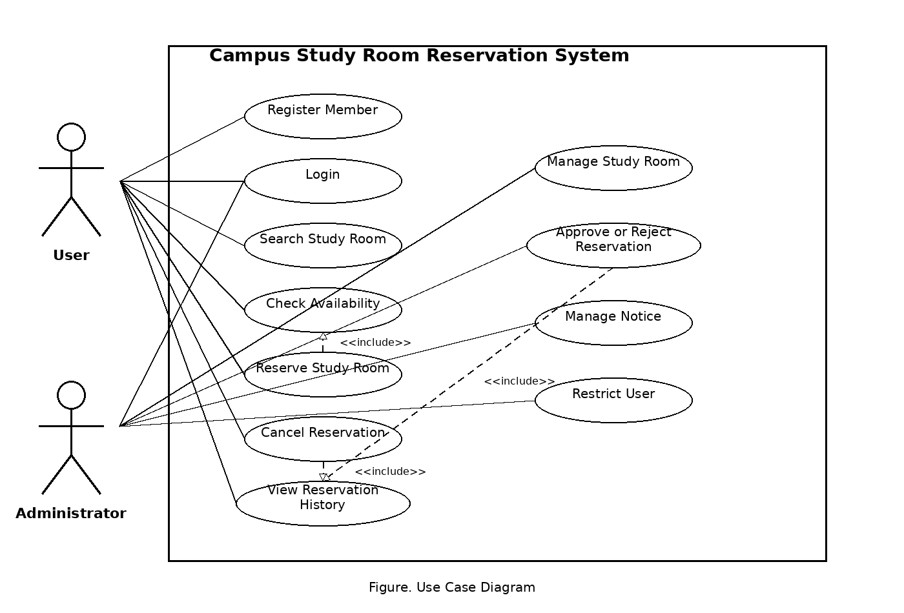

아래의 표는 위의 Class Diagram에서 표현한 Class들에 대한 설명이다.

| Class Name | Explanation |
|---|---|
| Login | 시스템을 실행한 이후 사용자가 가장 먼저 접근하게 되는 클래스이다. 사용자가 입력한 ID와 Password 값을 전달받아 회원 정보를 확인하고, 로그인 성공 여부를 판별한다. 로그인에 성공하면 사용자의 권한에 맞는 Main 화면으로 이동시키고, 로그인에 실패하면 오류 메시지를 출력한다. 또한 관리자 계정과 일반 회원 계정을 구분하여 서로 다른 기능 접근 권한을 제공한다. |
| Registration | 회원가입 기능을 담당하는 클래스이다. 사용자가 입력한 학번, 비밀번호, 이름, 학과, 이메일 등의 정보를 전달받아 회원가입 절차를 진행한다. 회원가입 과정에서 ID 중복 여부를 검사하며, 비밀번호 확인 입력값과 일치 여부도 함께 검사한다. 모든 조건이 정상적으로 충족되면 Server 클래스에 회원 정보를 저장하고 회원가입 완료 메시지를 출력한다. |
| Member | 시스템을 사용하는 회원들의 기본 정보를 저장하는 클래스이다. 회원의 ID, Password, 이름, 학과, 이메일, 권한 등의 Attribute를 가진다. 로그인 기능이나 예약 기능에서 사용자의 정보를 참조할 때 해당 클래스의 객체를 사용한다. 또한 일반 회원과 관리자를 구분하기 위한 권한 정보도 포함된다. |
| Server | 실제 네트워크 서버를 직접 구현하지 않는 대신 서버와 유사한 역할을 수행하는 클래스이다. 회원 정보, 스터디룸 정보, 예약 정보, 공지사항 정보를 저장하고 관리한다. 다른 기능 클래스들은 필요한 데이터를 요청할 때 Server 클래스를 통해 정보를 가져온다. 시스템 전체 데이터의 저장소 역할을 수행하는 핵심 클래스이다. |
| StudyRoom | 캠퍼스 내 스터디룸에 대한 정보를 저장하는 클래스이다. 스터디룸 번호, 위치, 최대 수용 인원, 예약 가능 여부 등의 Attribute를 가진다. SearchRoom 클래스나 Reservation 클래스는 해당 클래스의 정보를 사용하여 예약 가능한 스터디룸을 사용자에게 제공한다. 관리자는 이 클래스의 데이터를 수정하여 새로운 스터디룸을 추가하거나 기존 정보를 변경할 수 있다. |
| SearchRoom | 사용자가 원하는 날짜, 시간, 인원 수 조건에 맞는 스터디룸을 검색하는 기능을 담당하는 클래스이다. 사용자가 입력한 조건을 기반으로 Server 클래스에 저장된 스터디룸 정보를 조회한다. 검색 결과에서는 예약 가능한 스터디룸과 이미 예약된 스터디룸을 구분하여 사용자에게 출력한다. 또한 조건에 맞는 스터디룸이 없는 경우에는 관련 메시지를 출력한다. |
| CheckAvailability | 특정 스터디룸의 예약 가능 시간을 확인하는 기능을 담당하는 클래스이다. 사용자가 스터디룸을 선택하면 해당 클래스는 예약 데이터를 조회하여 현재 예약 가능한 시간대와 이미 예약된 시간대를 구분하여 출력한다. 예약 가능한 시간은 초록색과 같은 방식으로 표시하고, 예약이 완료된 시간은 다른 색으로 표시하여 사용자가 쉽게 구분할 수 있도록 한다. |
| Reservation | 사용자가 스터디룸 예약을 진행할 때 사용하는 클래스이다. 선택한 스터디룸, 날짜, 시간대, 사용 목적 등의 정보를 저장하며 예약 절차를 수행한다. 예약 과정에서 중복 예약 여부를 검사하고, 이미 예약된 시간인 경우 예약을 제한한다. 예약이 성공적으로 완료되면 Server 클래스에 예약 정보를 저장하고 예약 완료 메시지를 출력한다. |
| ReservationHistory | 로그인한 사용자의 예약 내역을 불러와 화면에 출력하는 클래스이다. 사용자는 이 기능을 통해 자신이 예약한 스터디룸 목록과 예약 상태를 확인할 수 있다. 또한 예약 시간이 지나지 않은 경우 예약 취소 기능을 수행할 수 있다. 예약 취소가 완료되면 해당 예약 상태를 변경하고 사용자 화면에 변경된 정보를 다시 출력한다. |
| ManageStudyRoom | 관리자만 사용할 수 있는 스터디룸 관리 기능을 담당하는 클래스이다. 관리자는 새로운 스터디룸을 등록하거나 기존 스터디룸의 위치, 인원 수, 사용 가능 여부 등을 수정할 수 있다. 또한 사용하지 않는 스터디룸을 삭제하는 기능도 수행한다. 수정된 정보는 Server 클래스에 저장되어 시스템 전체에 반영된다. |
| ManageNotice | 관리자가 공지사항을 등록, 수정, 삭제하는 기능을 담당하는 클래스이다. 시스템 메인 화면에 출력되는 공지사항 정보를 관리하며, 사용자들은 해당 공지사항을 통해 스터디룸 사용 관련 안내사항을 확인할 수 있다. 관리자는 새로운 공지를 작성하거나 기존 공지를 수정 및 삭제할 수 있다. |
| RestrictUser | 예약 규정을 반복적으로 위반한 사용자에게 제한을 부여하는 기능을 담당하는 클래스이다. 노쇼(No-show) 또는 부적절한 예약 사용 기록이 누적된 사용자를 일정 기간 동안 예약 불가능 상태로 변경한다. 제한이 적용된 사용자는 예약 기능을 사용할 수 없으며, 관리자만 제한을 해제할 수 있다. |

---

# 3. Sequence diagram

아래에 나오는 그림들은 Analysis에서 표현한 기능들을 Sequence Diagram으로 표현한 그림들이다.

## 3.1 Login Sequence Diagram

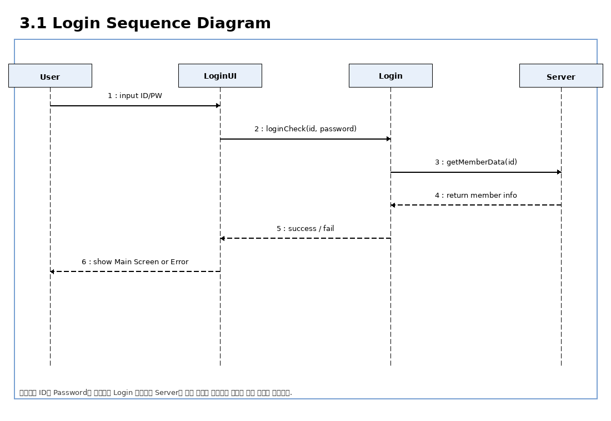

위의 그림은 시스템 실행 후 로그인 기능을 수행할 때를 표현한 Sequence Diagram이다. 사용자는 ID와 Password를 입력하고 LoginUI를 통해 Login 클래스에 로그인 검사를 요청한다. Login 클래스는 Server에 저장되어 있는 회원 정보를 조회하고, 입력한 정보가 일치하면 Main Screen을 보여준다. 정보가 일치하지 않으면 Error Message를 출력한다.

## 3.2 Registration Sequence Diagram

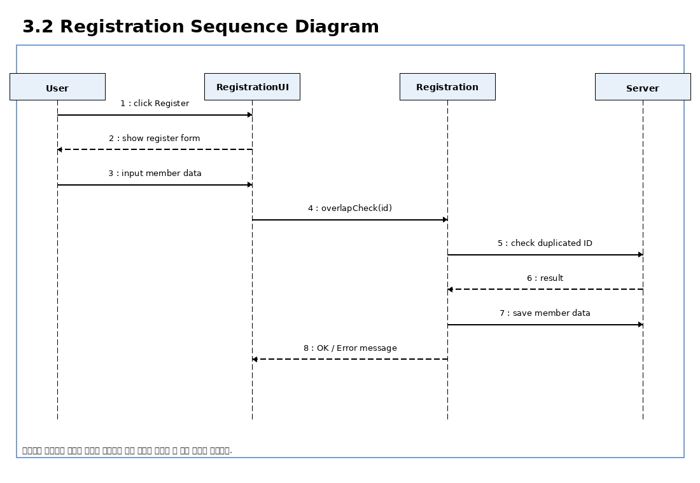

위의 그림은 시스템의 기능 중 회원가입에 대한 Sequence Diagram이다. 사용자가 Register 버튼을 누르면 RegistrationUI가 실행되고, 사용자는 학번, 비밀번호, 이름, 학과, 이메일 등의 정보를 입력한다. Registration 클래스는 ID 중복 여부를 확인한 후 문제가 없으면 Server에 회원 정보를 저장한다. 입력값에 문제가 있으면 Error Message를 출력한다.

## 3.3 Search Study Room / Check Availability Sequence Diagram

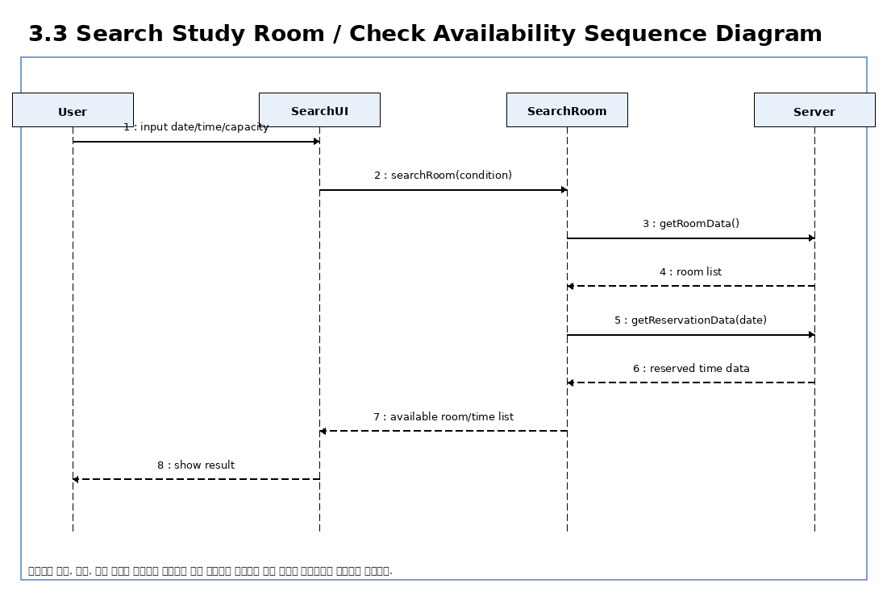

위의 그림은 스터디룸 조회 및 예약 가능 시간 확인 기능에 대한 Sequence Diagram이다. 사용자는 날짜, 시간, 인원 조건을 입력하고 Search 기능을 실행한다. SearchRoom 클래스는 Server에서 스터디룸 정보와 예약 정보를 가져와 사용 가능한 스터디룸과 시간대를 계산한 뒤 사용자 화면에 출력한다.

## 3.4 Reserve Study Room Sequence Diagram

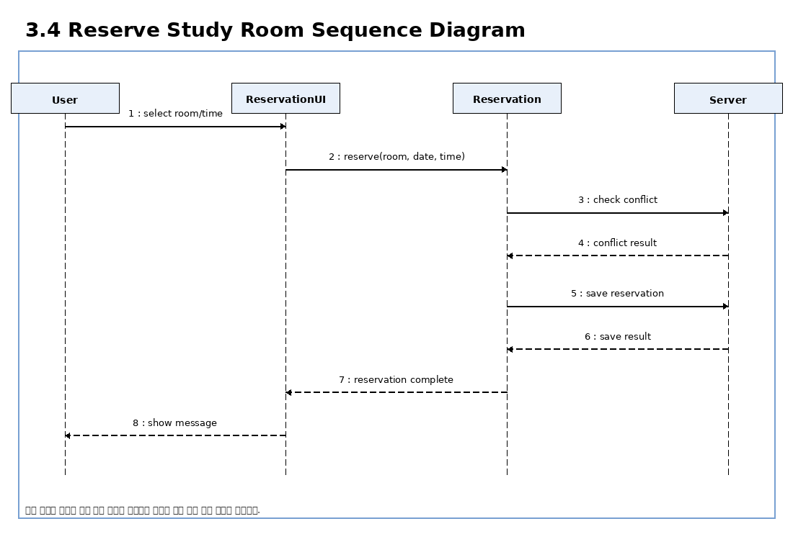

위의 그림은 스터디룸 예약 기능에 대한 Sequence Diagram이다. 사용자가 원하는 스터디룸과 시간대를 선택하고 예약 버튼을 누르면 Reservation 클래스가 중복 예약 여부를 확인한다. 해당 시간대가 예약 가능하면 예약 정보를 Server에 저장하고 예약 완료 메시지를 출력한다. 이미 예약된 시간인 경우 예약 실패 메시지를 출력한다.

## 3.5 View Reservation History / Cancel Sequence Diagram

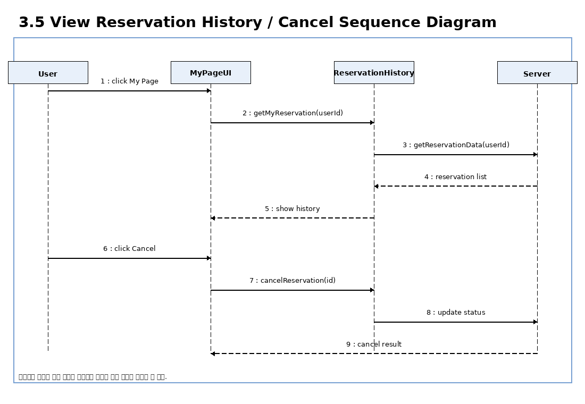

위의 그림은 예약 내역 조회 및 예약 취소 기능에 대한 Sequence Diagram이다. 사용자가 My Page 메뉴를 선택하면 ReservationHistory 클래스는 현재 로그인한 사용자의 예약 정보를 Server에서 가져와 출력한다. 사용자가 특정 예약을 취소하면 해당 예약의 상태가 취소로 변경되고 취소 완료 메시지가 출력된다.

## 3.6 Administrator Management Sequence Diagram

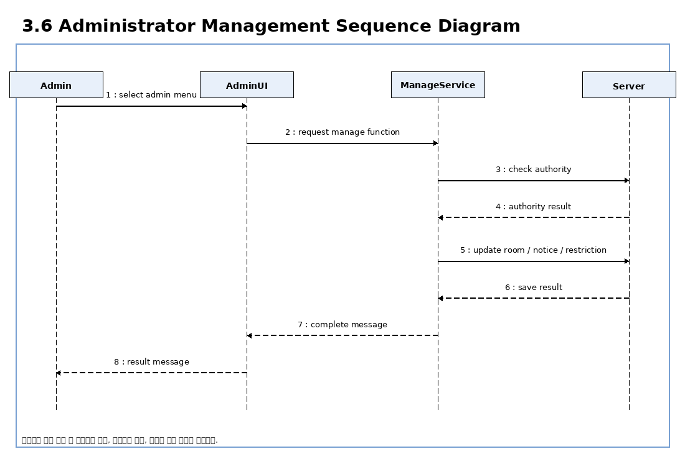

위의 그림은 관리자 기능에 대한 Sequence Diagram이다. 관리자는 관리자 메뉴에서 스터디룸 관리, 공지사항 관리, 사용자 제한 기능을 선택할 수 있다. 시스템은 먼저 관리자 권한을 확인하고, 권한이 확인된 경우 해당 기능을 수행한다. 권한이 없는 사용자는 기능을 사용할 수 없다.

---

# 4. State machine diagram

아래의 그림들은 시스템의 주요 기능에 대한 State Machine Diagram이다.

## 4.1 Login State Machine Diagram

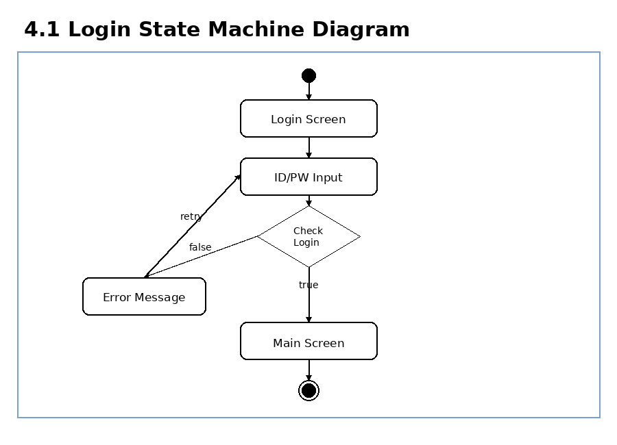

위의 그림은 로그인 과정의 상태 변화를 나타낸다. 시스템이 실행되면 로그인 화면이 나타나고, 사용자가 ID와 Password를 입력한다. 입력 정보가 올바르면 Main Screen으로 이동하고, 올바르지 않으면 Error Message를 출력한 후 다시 입력 상태로 돌아간다.

## 4.2 Reservation State Machine Diagram

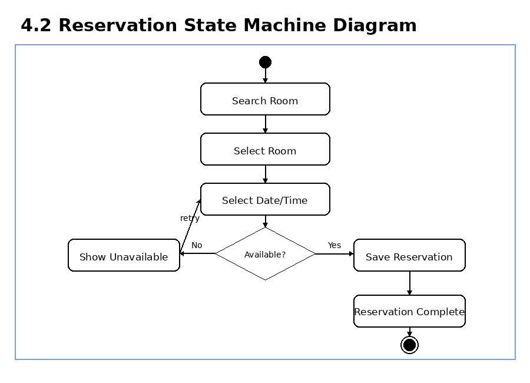

위의 그림은 스터디룸 예약 과정의 상태 변화를 나타낸다. 사용자는 스터디룸을 검색하고 원하는 날짜와 시간을 선택한다. 시스템은 해당 시간대가 예약 가능한지 확인한다. 예약 가능하면 예약 정보를 저장하고 Reservation Complete 상태로 이동한다. 예약할 수 없는 경우 다시 시간 선택 상태로 돌아간다.

## 4.3 Reservation History State Machine Diagram

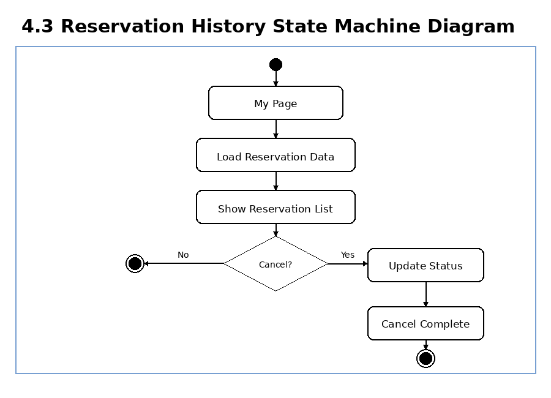

위의 그림은 예약 내역 조회 및 취소 과정의 상태 변화를 나타낸다. 사용자는 My Page에서 자신의 예약 내역을 확인할 수 있다. 취소할 예약이 있는 경우 Cancel을 선택하고 시스템은 예약 상태를 변경한다. 취소하지 않는 경우 예약 내역 확인 상태에서 종료된다.

## 4.4 Administrator Management State Machine Diagram

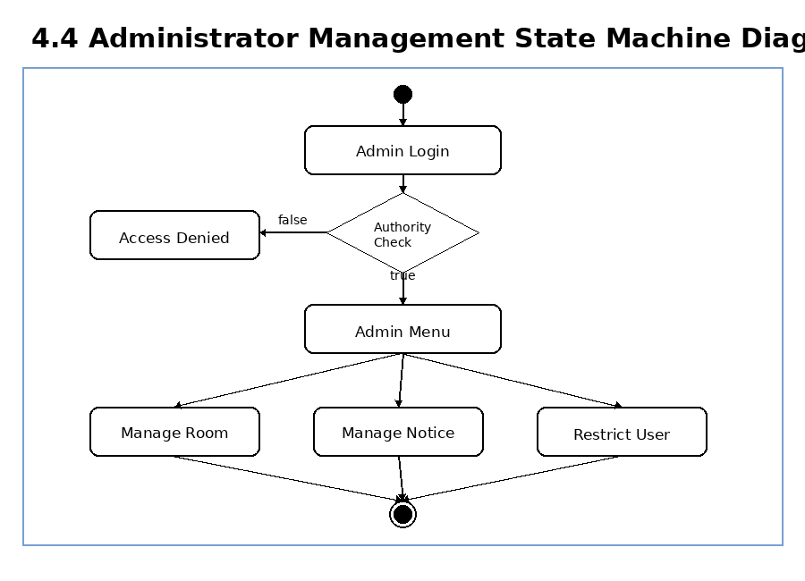

위의 그림은 관리자 기능의 상태 변화를 나타낸다. 관리자가 로그인하면 시스템은 권한을 확인한다. 권한이 없으면 접근이 거부되고, 권한이 있으면 관리자 메뉴로 이동한다. 관리자는 스터디룸 관리, 공지사항 관리, 사용자 제한 기능을 수행할 수 있다.

---

# 5. Implementation requirements

Campus Study Room Reservation System을 구동하기 위해 필요한 요구사항은 아래와 같다.

## 1) Hardware Requirements

| 항목 | 내용 |
|---|---|
| CPU | Intel Pentium IV 이상 |
| RAM | 2GB 이상 |
| HDD or SSD | 10GB 이상의 여유 공간 |
| Network | 기본 기능은 네트워크 연결 없이도 가능하나, 추후 서버 연동 시 네트워크 필요 |

## 2) Software Requirements

| 항목 | 내용 |
|---|---|
| Operating System | Windows 10 이상 |
| Implementation Language | Java JDK 1.8 이상 |
| IDE | Eclipse 또는 IntelliJ IDEA |
| UI | Java Swing |
| Data Storage | SQLite 또는 텍스트 파일 기반 저장 방식 |

## 3) Nonfunctional requirements

해당 시스템은 Java 기반 GUI 프로그램으로 구현한다. 사용자가 로그인, 회원가입, 스터디룸 조회, 예약, 예약 내역 조회, 예약 취소 기능을 쉽게 사용할 수 있도록 직관적인 화면을 제공한다.

예약 정보는 데이터베이스 또는 파일에 저장되며, 동일한 날짜와 시간대에 같은 스터디룸이 중복 예약되지 않도록 검사한다. 관리자는 일반 사용자와 구분되어야 하며, 관리자 권한이 있는 사용자만 스터디룸 관리, 공지사항 관리, 사용자 제한 기능을 사용할 수 있다.

---

# 6. Glossary

용어사전에 대해선 다음의 표와 같다.

| Terms | Description |
|---|---|
| Class Diagram | 객체지향형 시스템 설계에서 클래스들의 구조와 관계를 도식으로 정의한 것이다. |
| Sequence Diagram | 객체 간 메시지 흐름과 시간 순서를 표현하는 UML 다이어그램이다. |
| State Machine Diagram | 시스템 또는 객체가 가지는 상태와 상태 전이를 표현하는 UML 다이어그램이다. |
| GUI | 사용자가 버튼, 입력창, 표와 같은 화면 요소를 통해 시스템을 사용할 수 있도록 만든 그래픽 사용자 인터페이스이다. |
| Reservation | 사용자가 특정 날짜와 시간대에 스터디룸을 이용하기 위해 등록한 예약 정보이다. |
| Time Slot | 스터디룸 예약이 가능한 일정 단위의 시간 구간을 의미한다. |
| Administrator | 스터디룸 정보 관리, 예약 승인 및 거절, 공지사항 관리, 사용자 제한 기능을 수행하는 관리자이다. |
| Server | 회원 정보, 스터디룸 정보, 예약 정보 등을 저장하고 관리하는 역할을 수행하는 클래스이다. |
| Database | 사용자 정보, 스터디룸 정보, 예약 정보, 공지사항 정보를 저장하고 관리하는 데이터 저장소이다. |

---

# 7. References

- 소프트웨어 설계 강의자료
- Java Swing Tutorial – https://docs.oracle.com/javase/tutorial/uiswing/
- SQLite Documentation – https://www.sqlite.org/docs.html
- UML Diagram Tutorial – https://www.uml-diagrams.org/
